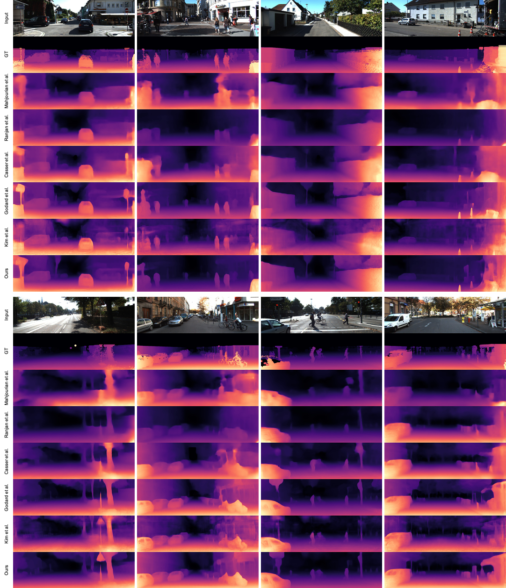

# Revisiting Self-Supervised Monocular Depth Estimation
[](https://arxiv.org/abs/)

## Introduction
We propose to have a closer look at potential synergies between various depth and motion learning methods and CNN architectures.
- For this, we revisit a notable subset of previously proposed learning approaches and categorize them into four classes: depth representation, illumination variation, occlusion and dynamic objects.
- Next, we design a comprehensive empirical study to unveil the potential synergies and architectural benefits. To cope with the large search space, we take an incremental approach in designing our experiments.

-------------------------------------------------------

As a result of our study, we uncover a number of vital insights. We summarize the most important as follows:

1. Choosing the right depth representation substantially improves the performance.
2. Not all learning approaches are universal, and they have their own context.
3. The combination of auto-masking and motion map handles dynamic objects in a robust manner
4. CNN architectures influence the performance significantly
5. There would exist a trade-off between depth consistency and performance enhancement. 

Moreover, we obtain new state-of-the-art performance in the process of performing our study.

-------------------------------------------------------

Below presents the qualitative and quantitative results of the proposed method compared to conventional methods.
<p float="center">
  
</p>

| Method          | Architecture | ARD | SRD  | RMSE | RMSElog | delta < 1.25 | delta < 1.25^2 | delta < 1.25^3|
|-------------------------|-------------------|--------------------------|-----------------|------|----------------|----------------|----------------|------------|
[Mahjourian et al.](https://arxiv.org/pdf/1802.05522) | DispNet | 0.163 | 1.240 | 6.220 | 0.250 | 0.762 | 0.916 | 0.968 |
[Ranjan et al.](https://openaccess.thecvf.com/content_CVPR_2019/papers/Ranjan_Competitive_Collaboration_Joint_Unsupervised_Learning_of_Depth_Camera_Motion_Optical_CVPR_2019_paper.pdf) | DispNet  | 0.148 | 1.149 | 5.464 | 0.226 | 0.815 | 0.935 | 0.973|
[Casser et al.](https://arxiv.org/pdf/1811.06152) | ResNet-18 | 0.141 | 1.026 | 5.291 | 0.215 | 0.816 | 0.945 | 0.979|
[Godard et al.](https://openaccess.thecvf.com/content_ICCV_2019/papers/Godard_Digging_Into_Self-Supervised_Monocular_Depth_Estimation_ICCV_2019_paper.pdf) | ResNet-18 | 0.115 | 0.903 | 4.863 | 0.193 | 0.877 | 0.959 | 0.981|
[Kim et al.](https://ieeexplore.ieee.org/document/9134970)  | ResNet-50 | 0.123 | <ins>0.797</ins> | 4.727 | 0.193 | 0.854 | 0.960 | **0.984**|
[Johnston et al.](http://openaccess.thecvf.com/content_CVPR_2020/papers/Johnston_Self-Supervised_Monocular_Trained_Depth_Estimation_Using_Self-Attention_and_Discrete_Disparity_CVPR_2020_paper.pdf)  | ResNet-18 | 0.111 | 0.941 | 4.817 | 0.189 | <ins>0.885</ins> | <ins>0.961</ins> | 0.981|
[Johnston et al.](http://openaccess.thecvf.com/content_CVPR_2020/papers/Johnston_Self-Supervised_Monocular_Trained_Depth_Estimation_Using_Self-Attention_and_Discrete_Disparity_CVPR_2020_paper.pdf)  | ResNet-101 | **0.106** | 0.861 | <ins>4.699</ins> | **0.185** | **0.889** | **0.962** | <ins>0.982</ins>|
Ours | ResNet-18 | 0.114 | 0.825 | 4.706 | 0.191 | 0.877 | 0.960 | 0.982|
Ours | DeResNet-50 | <ins>0.108</ins> | **0.737** | **4.562** | <ins>0.187</ins> | 0.883 | <ins>0.961</ins> | <ins>0.982</ins>|


> **Revisiting Self-Supervised Monocular Depth Estimation**                       
> [Ue-Hwan Kim](https://github.com/Uehwan), [Jong-Hwan Kim](http://rit.kaist.ac.kr/home/jhkim/Biography_en)                  
> [arXiv preprint](https://arxiv.org/abs/)

If you find this project helpful, please consider citing this project in your publications. The following is the BibTeX of our work.

```bibtex
@inproceedings{kim2020a,
  title={Revisiting Self-Supervised Monocular Depth Estimation},
  author={Kim Ue-Hwan, Kim Jong-Hwan},
  journal = {arXiv preprint arXiv:},
  year = {2021}
}
```

## Notification
**This repo is under construction... The full code will be available soon!**

## Installation
We implemented and tested our framework on Ubuntu 18.04/16.04 with python >= 3.6. We highly recommend that you set up the development environment using [Anaconda](https://www.anaconda.com/download/).

Then, the environment setting becomes easy as below.
```bash
conda create --name rmd python=3.7
conda activate rmd
conda install -c pytorch pytorch=1.4 torchvision cudatoolkit=10.1
conda install -c conda-forge tensorboard opencv
conda install -c anaconda scikit-image
pip install efficientnet_pytorch

git clone https://github.com/Uehwan/rmd.git
cd ./rmd/DCNv2
python setup.py build develop
```

## Training
### Pre-Trained Models
Coming soon.

## Evaluation
### Pre-Computed Results
Coming soon.

### Depth Evaluation
First of all, you need to export the ground-truth depth maps as follows:
```bash
python export_gt_depth.py --data_path kitti_data --split eigen
```

Then, you can measure the depth estimation performance simply as follows (you need to specify the model architecture and other training options):
```bash
python evaluate_depth.py --load_weights_folder ./logs/model_name/models/weights_19/ --depth_repr softplus --data_path kitti_data --motion_map --num_layers 180
```

### Pose Evaluation
For pose evaluation, you first need to prepare [the KITTI odometry dataset](http://www.cvlibs.net/datasets/kitti/eval_odometry.php) (color, 65GB). The dataset includes the ground truth poses as zip files.

You could convert the png images to jpg images. Or, you can pass the file extension as a parameter to the dataset class.

For evaluation, run the following:
```bash
python evaluate_pose.py --eval_split odom_9 --load_weights_folder ./logs/model_name/models/weights_19 --data_path kitti_odom/
python evaluate_pose.py --eval_split odom_10 --load_weights_folder ./logs/model_name/models/weights_19 --data_path kitti_odom/
```
